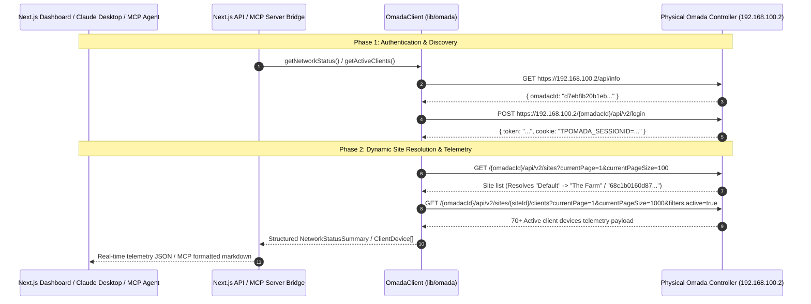

# Omada NOC Dashboard & MCP Bridge

A containerized, full-stack network observability platform that interfaces with a live, **physical TP-Link Omada SDN Hardware Controller appliance** (`192.168.100.2`) and exposes real-time network state directly to Large Language Models (LLMs) via the **Model Context Protocol (MCP)**.

Built with **Next.js 16 (App Router)**, **React 19**, **Tailwind CSS v4**, **TypeScript 5**, **@modelcontextprotocol/sdk**, and containerized using **Podman**.

---

## 🌐 Architecture & Topology

- **Physical Network Device:** Physical TP-Link Omada SDN Hardware Controller Appliance on LAN at `192.168.100.2` managing real hardware infrastructure (Access Points, Switches, Gateway, 70+ client devices).
- **Application Platform:** `noc_dash` full-stack Next.js 16 / React 19 web application & MCP stdio server bridge.
- **Production Runtime:** Containerized in **Podman** (rootless container runtime) communicating over the network with the physical hardware controller.



---

## 🌟 Key Capabilities

1. **Real-Time Network Telemetry Dashboard:**
   - Visualizes live connected clients (70+ devices), wired vs. Wi-Fi distribution, instantaneous aggregate bandwidth throughput, and session download/upload volume.
   - Interactive client telemetry table with selectable auto-polling intervals (5s Live, 10s, 30s, or Paused) and manual on-demand refresh.
   - Real-time client filtering (Medium: All / Wi-Fi / Ethernet, and search query across device name, hostname, IP, MAC, SSID) and multi-attribute sorting (Instantaneous Throughput, Cumulative Data, Uptime).

2. **Model Context Protocol (MCP) Server Bridge & AI Agent Runner:**
   - Implements `@modelcontextprotocol/sdk` to expose structured tools (`get_network_status`, `get_active_clients`) to LLM clients (e.g., Claude Desktop, MCP Inspector, custom agents).
   - Dedicated question-answering CLI (`npm run mcp:agent`) demonstrating real JSON-RPC tool selection and telemetry question-answering over stdio.

3. **Resilient Omada v5 API Engine:**
   - Multi-step Omada v5.15 authentication (`omadacId` auto-discovery via `/api/info`, followed by `POST /api/v2/login` for CSRF token and `TPOMADA_SESSIONID` session cookie).
   - Dynamic site resolution mapping human-readable site names (e.g. `"Default"`) to internal controller hex IDs (`"The Farm"`).
   - Session token caching and automatic re-authentication upon session expiration or HTTP 401.

4. **Container Orchestration with Podman:**
   - Multi-stage rootless `Containerfile` leveraging Next.js standalone output for minimal image size, zero host dependencies, and strict Linux container security in production.

5. **Automated Testing Suite (> 99.5% Coverage):**
   - 66 comprehensive unit and integration tests powered by **Vitest**, **V8 coverage**, **@testing-library/react**, and **JSDOM**.
   - Dedicated controller diagnostic CLI tool (`npm run test:controller`) verifying live physical hardware controller connectivity.

---

## 🚀 Getting Started

### 1. Prerequisites
- **Node.js 20+**
- **npm 10+**
- **Podman** (or Docker)
- LAN access to the physical TP-Link Omada Hardware Controller (`192.168.100.2`)

### 2. Environment Configuration
The `.env.local` file contains the credentials for the physical Omada Hardware Controller:

```ini
OMADA_URL=192.168.100.2
OMADA_USER=your_email@example.com
OMADA_PASS=your_controller_password
OMADA_SITE=Default
OMADA_ALLOW_INSECURE_SSL=true
```

| Variable | Example Value | Description |
| :--- | :--- | :--- |
| `OMADA_URL` | `192.168.100.2` | Physical Omada controller IP or URL |
| `OMADA_USER` | `onejames@gmail.com` | Controller admin username / email |
| `OMADA_PASS` | `********` | Controller admin password |
| `OMADA_SITE` | `Default` | Target site name (auto-resolves to `"The Farm"`) |
| `OMADA_ALLOW_INSECURE_SSL` | `true` | Allow self-signed SSL certificates from physical hardware |

### 3. Local Development

```bash
# Install dependencies
npm install

# Start Next.js development server
npm run dev
```

Open [http://localhost:3000](http://localhost:3000) in your browser.

---

## 🔍 Physical Controller Diagnostics (`npm run test:controller`)

Run the standalone hardware diagnostic CLI to verify connectivity against the physical controller at `192.168.100.2`:

```bash
npm run test:controller
```

---

## 🤖 Model Context Protocol (MCP) Integration & Testing

The MCP server connects Large Language Models (e.g. Claude Desktop, AI agents) directly to live Omada network telemetry.

### Exposed MCP Tools

1. **`get_network_status`**
   - Retrieves real-time controller connectivity, connected client counts (wired vs. wireless breakdown), aggregate throughput, and cumulative data volume.
2. **`get_active_clients`**
   - Retrieves connected client devices with IP, MAC, connection medium (Wi-Fi SSID, signal dBm, switch port), real-time bandwidth rate, cumulative data volume, and uptime.
   - **Parameters:**
     - `connection_type`: `"all"` | `"wireless"` | `"wired"` (default: `"all"`)
     - `sort_by`: `"activity"` | `"traffic"` | `"uptime"` (default: `"activity"`)
     - `limit`: number 1–100 (default: `10`)

### 1. Interactive AI Agent Runner (`npm run mcp:agent`)
Runs an automated question-answering agent that connects to the MCP server over stdio, executes tool discovery, reasons through natural language questions, and queries live hardware telemetry:

```bash
npm run mcp:agent
```

### 2. Official MCP Visual Inspector (`npm run mcp:inspect`)
Launches the official Anthropic MCP Web Inspector UI where you can visually inspect schemas and execute live tool calls:

```bash
npm run mcp:inspect
```

### 3. Claude Desktop Native Integration
Add the server entry to your `claude_desktop_config.json`:

```json
{
  "mcpServers": {
    "omada-noc": {
      "command": "npx",
      "args": ["-y", "tsx", "/path/to/noc_dash/mcp/cli.ts"],
      "env": {
        "OMADA_URL": "192.168.100.2",
        "OMADA_USER": "onejames@gmail.com",
        "OMADA_PASS": "your_password",
        "OMADA_SITE": "Default",
        "OMADA_ALLOW_INSECURE_SSL": "true"
      }
    }
  }
}
```

Now you can ask Claude Desktop directly:
- *"Which devices are consuming the most bandwidth right now?"*
- *"Show me all wireless clients connected to the network."*
- *"Is the Omada controller online and what is the aggregate traffic?"*

---

## 🐳 Container Deployment with Podman & Docker

In production, the `noc_dash` dashboard and MCP bridge are packaged into an unprivileged container that queries the physical controller across the local network.

### Automated Container Scripts
```bash
# Build the container (executes full type-check, lint, and test suite inside builder stage)
./scripts/build-container.sh

# Run the container (auto-loads .env.local and maps to port 3000 or 3001)
./scripts/run-container.sh
```

### Direct Podman Commands
```bash
# Build
podman build -t noc_dash:latest -f Containerfile .

# Run
podman run -d \
  --name noc_dash \
  -p 3000:3000 \
  --env-file .env.local \
  noc_dash:latest
```

### Kubernetes & Kustomize Deployment
Deploy declarative Kubernetes manifests located in [`k8s/`](file:///Users/jameslaster/Code/posh/noc_dash/k8s):
```bash
kubectl apply -k k8s/
```

---

## 🧪 Testing & Quality Assurance

```bash
# Run all unit and integration tests
npm test

# Run tests with V8 code coverage report
npm run test:coverage

# Run live physical controller connectivity diagnostics
npm run test:controller

# Run MCP AI Agent Question-Answering demo
npm run mcp:agent

# Production build (runs strict type-checking, ESLint, and test coverage before compiling)
npm run build
```

### Code Coverage Summary

```text
=============================== Coverage summary ===============================
Statements   : 99.50% ( 333/337 )
Lines        : 99.50% ( 311/314 )
Functions    : 100.0% ( 50/50 )
Branches     : 86.66% ( 361/411 )
================================================================================
Test Suites  : 8 passed (8 total)
Tests        : 66 passed (66 total)
```

| Module | Statements | Lines | Functions | Description |
| :--- | :--- | :--- | :--- | :--- |
| [`lib/omada/client.ts`](file:///Users/jameslaster/Code/posh/noc_dash/lib/omada/client.ts) | **98.72%** | **98.51%** | **100%** | Physical Omada controller auth, token caching, site resolution |
| [`lib/omada/formatters.ts`](file:///Users/jameslaster/Code/posh/noc_dash/lib/omada/formatters.ts) | **100%** | **100%** | **100%** | Byte, throughput rate, uptime, and MAC formatting |
| [`app/api/telemetry/route.ts`](file:///Users/jameslaster/Code/posh/noc_dash/app/api/telemetry/route.ts) | **100%** | **100%** | **100%** | Telemetry REST API route with sorting and filtering |
| [`mcp/server.ts`](file:///Users/jameslaster/Code/posh/noc_dash/mcp/server.ts) | **100%** | **100%** | **100%** | MCP Stdio server bridge & tool handlers |
| [`app/components/Dashboard.tsx`](file:///Users/jameslaster/Code/posh/noc_dash/app/components/Dashboard.tsx) | **99.77%** | **99.77%** | **100%** | Interactive telemetry dashboard client component |
| [`app/page.tsx`](file:///Users/jameslaster/Code/posh/noc_dash/app/page.tsx) | **100%** | **100%** | **100%** | Next.js Server Component SSR entrypoint |
| [`tests/integration/mcp-client.test.ts`](file:///Users/jameslaster/Code/posh/noc_dash/tests/integration/mcp-client.test.ts) | **100%** | **100%** | **100%** | End-to-end MCP client-server integration test |

---

## 📂 Project Structure

```text
noc_dash/
├── app/
│   ├── api/
│   │   └── telemetry/
│   │       └── route.ts             # Telemetry JSON REST API route handler
│   ├── components/
│   │   └── Dashboard.tsx            # Interactive React 19 Client Component dashboard
│   ├── globals.css                  # Tailwind CSS v4 stylesheets
│   ├── layout.tsx                   # Root HTML layout and metadata
│   └── page.tsx                     # Server Component (SSR initial telemetry fetch)
├── lib/
│   └── omada/
│       ├── client.ts                # Physical Omada v5 API Client & token manager
│       └── formatters.ts            # Formatting utilities (bytes, rates, uptime, MAC)
├── mcp/
│   ├── cli.ts                       # CLI executable for Model Context Protocol server
│   └── server.ts                    # Model Context Protocol stdio server bridge
├── scripts/
│   ├── build-container.sh           # Automated container build script
│   ├── run-container.sh             # Automated container run script
│   ├── mcp-agent.ts                 # AI Agent question-answering runner
│   └── test-controller.ts           # Standalone controller diagnostic test CLI
├── k8s/
│   ├── deployment.yaml              # Kubernetes Deployment manifest
│   ├── service.yaml                 # Kubernetes Service manifest
│   └── kustomization.yaml           # Kustomize declaration
├── tests/
│   ├── integration/
│   │   ├── controller.test.ts       # Controller integration test suite
│   │   └── mcp-client.test.ts       # MCP client-server end-to-end integration test
│   ├── unit/
│   │   ├── client.test.ts           # OmadaClient unit tests
│   │   ├── dashboard.test.tsx       # Dashboard UI unit tests
│   │   ├── formatters.test.ts       # Formatter unit tests
│   │   ├── mcp-server.test.ts       # MCP bridge & tool handler tests
│   │   ├── page.test.ts             # Server page component tests
│   │   └── telemetry-route.test.ts  # API route tests
│   └── setup.ts                     # Vitest setup (jest-dom matchers)
├── types/
│   └── omada.ts                     # TypeScript definitions for API & devices
├── docs/                            # Project specifications & roadmap
│   ├── PRD.md                       # Product Requirements Document
│   ├── implementationPlan.md        # Timeline and development phases
│   ├── posting.md                   # Job description and qualifications
│   └── techStack.md                 # Tech stack and job alignment details
├── compose.yaml                     # Compose specification for Podman / Docker
├── Containerfile                    # Multi-stage container definition for Podman
├── vitest.config.ts                 # Vitest & V8 coverage configuration
├── eslint.config.mjs                # ESLint configuration
├── next.config.ts                   # Next.js configuration (output: standalone)
└── package.json
```

---

## 💼 GlobalNOC Alignment Matrix

| Project Component | GlobalNOC Job Requirement / Preference | Justification |
| :--- | :--- | :--- |
| **Next.js 16 + React 19 + Tailwind** | *"Provides advanced research/analysis... UX/UI design/philosophy"* & *"Visualizations to help end users understand their data"* | Delivers a high-density, accessible NOC dashboard with real-time polling, dark-mode ergonomics, and sub-second filtering. |
| **Model Context Protocol (MCP)** | *"Experience with programmatic use of LLMs, AI, and related systems. Integration of data sources into LLMs via MCP or similar protocols."* | Bridges physical enterprise network telemetry with LLMs using the open Model Context Protocol standard, complete with interactive AI agent runner (`npm run mcp:agent`). |
| **Podman Containerization & K8s** | *"Experience with application containerization platforms such as docker and podman"* & *"kubernetes application deployment methods such as helm or kustomize."* | Rootless multi-stage container deployment with Compose and Kustomize declarations ready for cloud-native orchestration. |
| **TypeScript Omada Engine** | *"Design, development, testing... tuning of software systems"* & *"Network measurement, monitoring, visualization."* | Reverse-engineered physical hardware controller API handshakes (two-step auth, CSRF tokens, session cookies, dynamic site resolution for `"The Farm"`), strict type modeling, and robust error recovery. |
| **Testing Suite (> 99.5% Coverage)** | *"Testing, configuration, and maintenance of reliable software"* | Automated testing with 66 tests across 8 test suites, build gates, and hardware diagnostic scripts testing live appliances on the LAN. |
