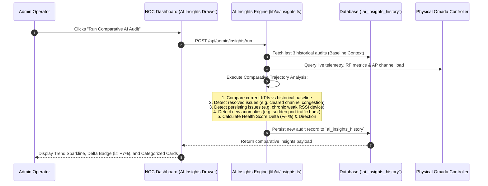

# Executive Reporting & Iterative AI Insights Architecture

This document defines the architecture, data models, aggregation logic, PDF export engine, and **Iterative Continuous Learning AI Engine** for the Omada NOC Dashboard.

---

## 🏛️ System Architecture Overview

```
┌────────────────────────────────────────────────────────────────────────────────────────┐
│                                   OMADA NOC DASHBOARD                                  │
├───────────────────────────────────────────┬────────────────────────────────────────────┤
│       1. EXECUTIVE PDF REPORTS ENGINE     │       2. ITERATIVE AI INSIGHTS ENGINE      │
├───────────────────────────────────────────┼────────────────────────────────────────────┤
│ • Telemetry & History Aggregation API     │ • Stateful AI Memory (`ai_insights_history`)│
│ • Top 5 Active Devices (Throughput Rate)  │ • Multi-Run Comparative Learning Loop      │
│ • Top 5 Heavy Consumers (Traffic Volume)  │ • Better / Worse / Persisting Delta Logic  │
│ • Top 5 Active Users / Operators          │ • 6th MCP Tool: `get_audit_history`        │
│ • High-Res Vector PDF Generator (jsPDF)   │ • Admin AI Insights Drawer & Trend Chart   │
└───────────────────────────────────────────┴────────────────────────────────────────────┘
```

---

## 📑 Part 1: General Reports & Executive PDF Engine

### 1. Objective
Transform live controller telemetry and historical database records into an **Executive Briefing & SLA Compliance Dossier**. Operators and management can view real-time data aggregations on-screen or download an executive-grade vector PDF.

### 2. Aggregation Data Specification (`GET /api/reports/summary`)

| Metric Domain | Data Points Aggregated | Business & Engineering Value |
| :--- | :--- | :--- |
| **Executive Overview** | Health Score (0–100), Controller Uptime, Site Name (`The Farm`), Gateway Latency, WAN Status. | High-level SLA compliance and platform readiness. |
| **Infrastructure Inventory** | Total Access Points (9), JetStream Switches (4), Gateway (1), Total Clients (70+). | Hardware topology status and node health. |
| **Frequency & Medium Split** | Wired vs. Wireless ratio, 2.4 GHz vs. 5 GHz client distribution. | Spectrum efficiency and RF congestion analysis. |
| **Top 5 Active Devices (Rate)** | Ranked by instantaneous throughput (Mbps upload/download), MAC, IP, SSID/Port. | Identifies real-time bandwidth spikes and traffic bursts. |
| **Top 5 Heavy Consumers (Volume)**| Ranked by cumulative session volume (GB/MB), uptime, connection timestamp. | Identifies chronic heavy bandwidth users over time. |
| **Top 5 System Users / Operators** | Ranked by tagged hardware count, role (`ADMIN`/`USER`), and recent audit activity. | Multi-tenant utilization and administrative tracking. |
| **RF Signal Quality Matrix** | Client distribution across RSSI tiers: Excellent ($> -60$ dBm), Good ($-60$ to $-70$), Fair ($-70$ to $-80$), Poor ($< -80$). | Wireless coverage health and roaming candidate detection. |
| **Security & Audits** | 24-hour authentication success rate, failed login counts, active operator sessions. | SOC 2 audit readiness and access security posture. |

### 3. Vector PDF Generation Architecture (`jspdf` + `jspdf-autotable`)
- **Zero-Dependency Vector Output:** Generated using pure TypeScript/JavaScript vector drawing commands. Eliminates bulky headless Chromium/Puppeteer dependencies, keeping the container image ultra-light (<100MB).
- **Layout:** Standard A4 / Letter format with dark/light NOC styling, crisp typography, status badges, multi-column metric tables, and a cryptographic verification hash.
- **Export Trigger:** 1-click **Download PDF** button directly from the **Executive Reports Modal**.

---

## 🧠 Part 2: Iterative AI Insights (Continuous Memory & Learning)

### 1. Objective
Traditional LLM diagnostics are **stateless** (they evaluate the system in isolation and immediately forget previous findings). The **Iterative AI Insights Engine** establishes **stateful long-term memory**, enabling the agent to track whether network conditions are **improving, degrading, or persisting** across successive audits.

### 2. The Iterative Learning Loop



---

### 3. Database Schema: `ai_insights_history` Table

```sql
CREATE TABLE IF NOT EXISTS ai_insights_history (
  id UUID PRIMARY KEY DEFAULT gen_random_uuid(),
  created_at TIMESTAMPTZ NOT NULL DEFAULT NOW(),
  triggered_by_user_id UUID REFERENCES users(id) ON DELETE SET NULL,
  health_score INTEGER NOT NULL,             -- Health score (0 to 100)
  previous_score INTEGER,                   -- Score from previous audit run
  score_delta INTEGER,                      -- e.g. +8, -4, 0
  trend_direction VARCHAR(20) NOT NULL,     -- 'IMPROVED' | 'DEGRADED' | 'STABLE' | 'INITIAL'
  executive_summary TEXT NOT NULL,          -- High-level LLM diagnostic verdict
  resolved_issues JSONB DEFAULT '[]',       -- Issues from prior run that are now fixed
  persisting_issues JSONB DEFAULT '[]',     -- Chronic issues observed across multiple runs
  new_issues JSONB DEFAULT '[]',            -- Freshly identified warnings / anomalies
  actionable_suggestions JSONB DEFAULT '[]', -- Ranked remediation steps
  metrics_snapshot JSONB NOT NULL           -- Snapshot of network KPIs at audit timestamp
);

CREATE INDEX IF NOT EXISTS idx_ai_insights_created_at ON ai_insights_history (created_at DESC);
```

---

### 4. Comparative Trajectory & Delta Logic

The engine categorizes findings into four distinct trajectory states:

| Trajectory State | Condition | UI Indicator | Example Diagnostic Finding |
| :--- | :--- | :---: | :--- |
| **`INITIAL`** | First audit run (no baseline history in DB). | 🔵 `INITIAL BASELINE` | *"Baseline established (Score: 88/100). Future audits will track trends against this benchmark."* |
| **`IMPROVED`** | Current score $>$ Previous score (or prior warnings resolved). | 🟢 `📈 IMPROVED (+7%)` | *"Channel 6 utilization on EAP-Warehouse dropped from 84% to 22% (Resolved from Audit #3)."* |
| **`DEGRADED`** | Current score $<$ Previous score (or new critical warnings surfaced). | 🔴 `📉 DEGRADED (-5%)` | *"Total Wi-Fi retry rate increased from 1.2% to 4.9%; 3 new clients experiencing high latency."* |
| **`STABLE`** | Score within $\pm 2\%$ delta with consistent operating parameters. | 🟡 `⚖️ STABLE (0%)` | *"Network parameters remain consistent with previous audit. No new regressions detected."* |

#### Categorized Findings Structure:
1. **🟢 Resolved Issues:** Previous anomalies that no longer appear in the current telemetry window.
2. **🟡 Persisting Issues:** Recurring issues tracked with a `persistedCount` (e.g. *"Device 'MacBook-Pro-Dev' has remained on 2.4 GHz with weak -83 dBm RSSI for 3 consecutive audits"*).
3. **🔴 New Anomalies:** Newly detected threshold breaches (e.g. sudden switch port bandwidth surge).

---

## 🤖 Part 3: Model Context Protocol (MCP) Tool Integration

A 6th tool is added to the MCP Server bridge ([`mcp/server.ts`](file:///Users/jameslaster/Code/posh/noc_dash/mcp/server.ts)):

### Tool 6: `get_audit_history`
* **Description:** Retrieves the chronological timeline of AI network health audits, score trends, resolved issues, and persisting warnings.
* **Parameters:**
  - `limit` *(optional number, default 5)*: Number of past audits to retrieve.
* **Value:** Enables external LLMs (Claude Desktop, AI Copilot CLI, Gemini, Cursor) to reason over long-term network history, compare prior recommendations with current status, and learn from past operational interventions.

---

## 🖥️ Part 4: User Interface Experience

### 1. Top Navigation Actions
Two interactive triggers added to the main navigation bar:
- **`📊 Executive Report`**: Available to all authenticated users. Opens the comprehensive aggregation modal with 1-click PDF download.
- **`🧠 AI Insights`**: Admin-only button with a gradient badge. Opens the continuous memory drawer.

### 2. Executive Reports Modal (`ReportsModal.tsx`)
- Tabular views for Top 5 Active Devices (Throughput Rate) and Top 5 Heavy Consumers (Traffic Volume).
- Top 5 Registered Users and their tagged hardware counts.
- Wireless RF Signal Health bar chart.
- 1-click **Download PDF** button generating a pixel-perfect vector document.

### 3. Admin AI Insights Drawer (`AiInsightsDrawer.tsx`)
- **Health Score Sparkline:** Visual trajectory graph of the last 10 audits.
- **Comparative Delta Header:** Shows score difference ($\pm \%$) and trend direction.
- **Issue Tracker Tabs:**
  - `🟢 Resolved (N)`: Issues resolved since prior audits.
  - `🟡 Persisting (N)`: Ongoing chronic warnings with recurrence counters.
  - `🔴 New Anomalies (N)`: Freshly discovered warnings.
- **"Run New Audit" Button:** Triggers a live telemetry scan with cyber radar animation, updates the database, and appends the new insight to the timeline.
